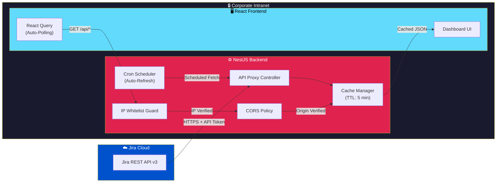
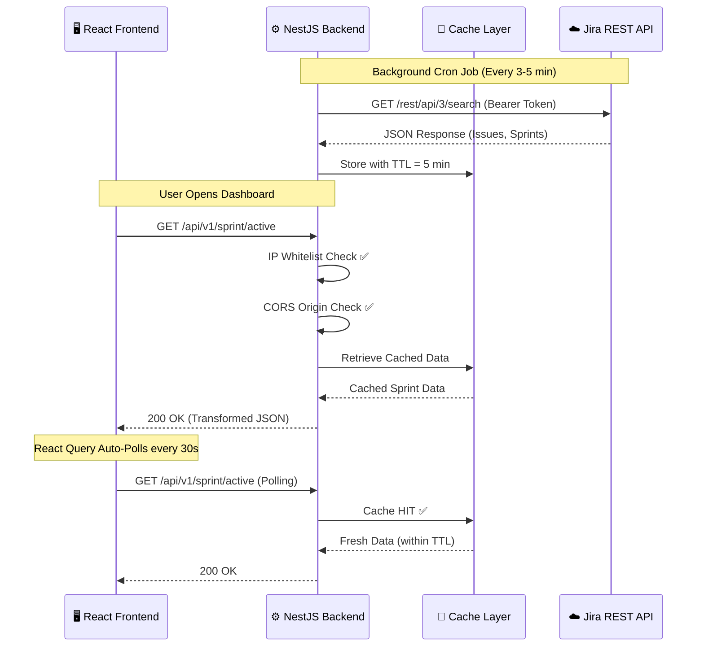
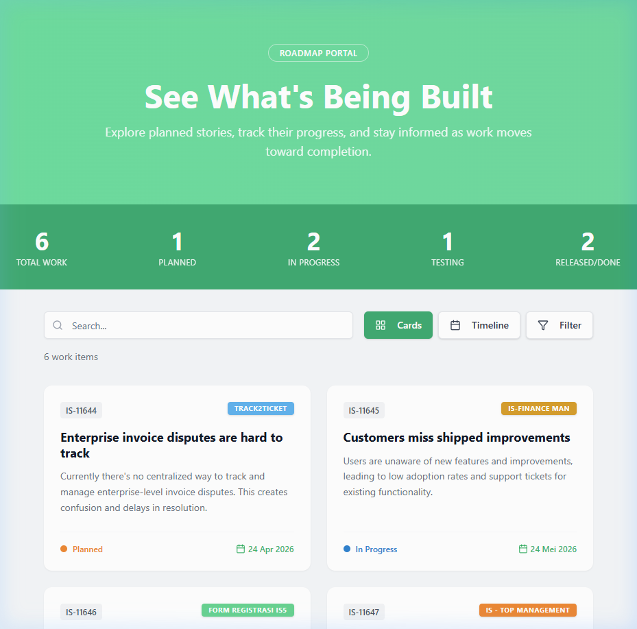
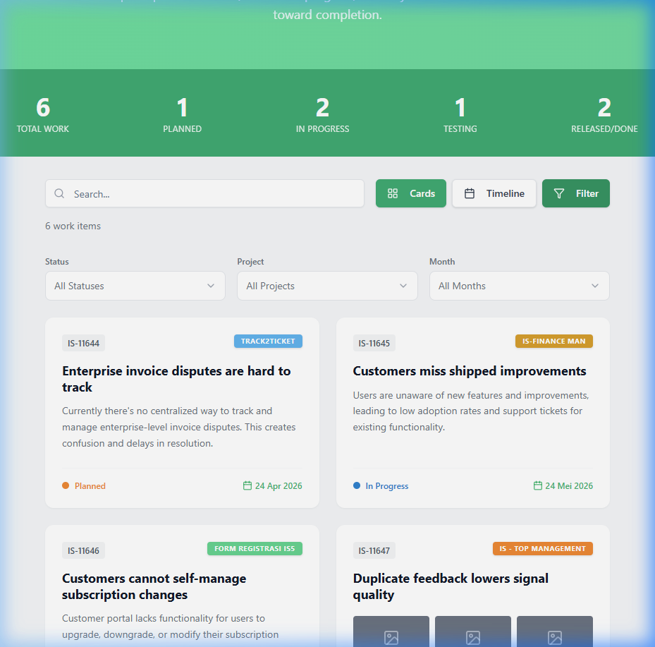
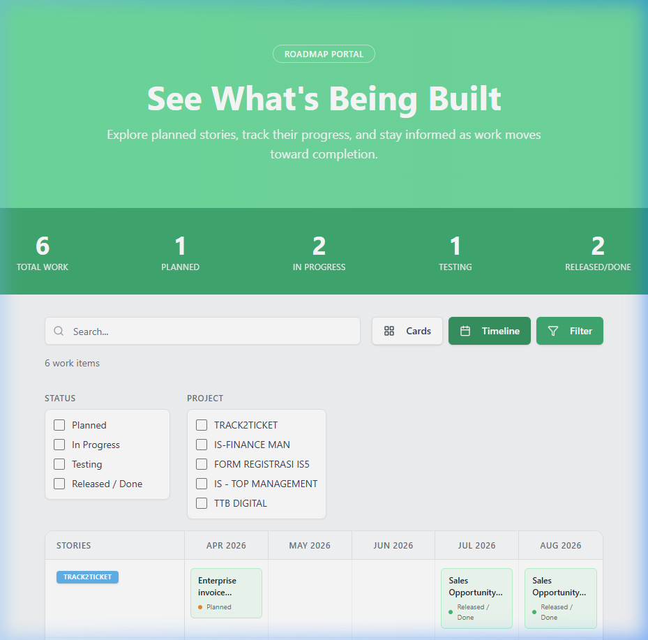
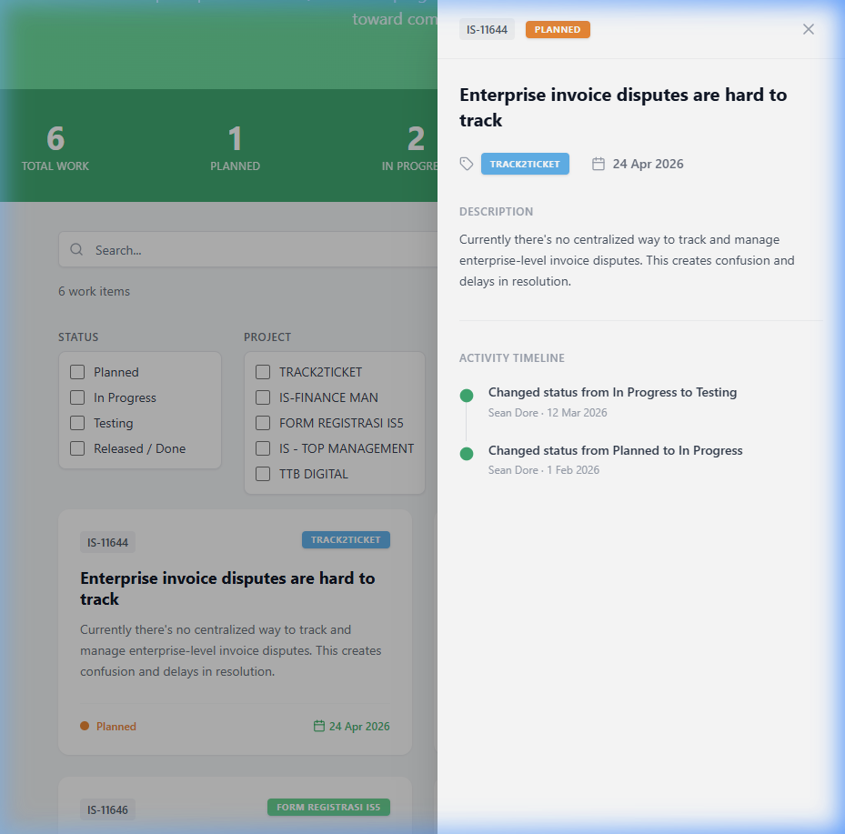
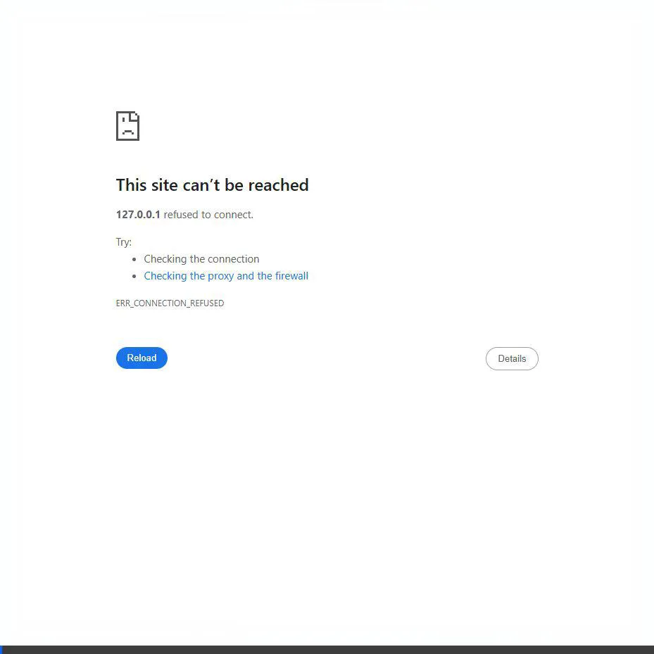

<p align="center">
  
</p>

<h1 align="center">🏢 Portal Nusa</h1>

<p align="center">
  <strong>Real-Time Jira Visualization Dashboard for Engineering Teams</strong><br/>
  <em>Cut through the noise. See what matters.</em>
</p>

<p align="center">
  
  
  
  
</p>

<p align="center">
  
  
  
  
  
  
</p>

---

## 📋 Table of Contents

- [About The Project](#-about-the-project)
- [User Interface Preview](#-user-interface-preview)
- [System Architecture](#-system-architecture)
- [Key Features](#-key-features)
- [Security Matrix](#-security-matrix)
- [Tech Stack Directory](#-tech-stack-directory)
- [Getting Started](#-getting-started)
- [Environment Variables](#-environment-variables)
- [Architecture & Directory Structure](#-architecture--directory-structure)
- [API Endpoints Reference](#-api-endpoints-reference)
- [Contributing](#-contributing)
- [Development Progress](#-development-progress)
- [License & Contact](#-license--contact)

---

## 🎯 About The Project

### The Problem: Jira Fatigue

Engineering teams relying on Jira often experience **information overload**. The native Jira interface—while powerful—presents an overwhelming volume of data: nested epics, complex filter chains, deeply threaded comments, and cluttered board views. For daily stand-ups, sprint retrospectives, and quick status checks, engineers spend more time *navigating* Jira than *acting* on information.

This phenomenon, commonly referred to as **"Jira Fatigue"**, leads to:
- ⏱️ Wasted time sifting through irrelevant data
- 🔇 Missed blockers that get buried in noise
- 📉 Reduced sprint velocity awareness across team members
- 🤷 Inconsistent understanding of sprint health between stakeholders

### The Solution: Portal Nusa

**Portal Nusa** is a purpose-built, read-only visualization dashboard that extracts and distills critical project data from Jira into a clean, minimal, and actionable interface. Inspired by the design language of [REV IO](https://www.rev.io/), it prioritizes **immediate utility** over exhaustive data display.

Portal Nusa provides engineering teams with a **single-glance view** of:

| Metric              | Description                                                |
|----------------------|------------------------------------------------------------|
| 📝 **To Do**        | Tasks queued and awaiting assignment or initiation          |
| 🔄 **In Progress**  | Active work items currently being executed                  |
| 🚧 **Blockers**     | Impediments requiring immediate escalation or resolution   |
| ✅ **Done**          | Completed deliverables within the current sprint cycle     |
| 🎯 **Sprint Goals** | High-level objectives and their real-time completion status |

> **Design Philosophy:** *"If an engineer needs more than 3 seconds to understand sprint health, the dashboard has failed."*

---

## 🖼️ User Interface Preview

Portal Nusa's interface draws heavy inspiration from [REV IO's](https://www.rev.io/) modern dashboard aesthetic — emphasizing clean typography, generous whitespace, and data-dense card layouts without visual clutter.

### Main Dashboard


### Task Breakdown View


### Blocker & Risk Panel


### Sprint Goals Tracker


---

### 🎨 Design Collaboration

| Resource             | Link                                                        |
|----------------------|-------------------------------------------------------------|
| 🎨 Figma Prototype   | [Open in Figma →](https://www.figma.com/file/REPLACE_WITH_FIGMA_FILE_ID) |
| 📐 Design System     | [Open Design Tokens →](https://www.figma.com/file/REPLACE_WITH_DESIGN_SYSTEM_ID) |
| 🖼️ Asset Library     | [View Assets →](docs/assets/)                               |
| 📝 UI Specifications | [View Spec Document →](docs/ui-specifications.md)           |

> **📌 Note for Engineers:** Before starting any frontend slicing work, always refer to the Figma file above for pixel-accurate measurements, spacing tokens, color variables, and component states (hover, active, disabled).

---

## 🏗️ System Architecture

Portal Nusa follows a **decoupled, proxy-based architecture**. The React frontend **never** communicates directly with Jira's REST API. All data flows through the NestJS backend, which acts as a secure proxy, cache layer, and data transformer.



### Data Flow Sequence



---

## ✨ Key Features

| #  | Feature                         | Description                                                                                         |
|----|----------------------------------|-----------------------------------------------------------------------------------------------------|
| 01 | 📊 **Sprint Health Dashboard**   | At-a-glance visualization of To Do, In Progress, Blocked, and Done tasks per active sprint          |
| 02 | 🎯 **Sprint Goal Tracker**       | Real-time progress bars and completion metrics aligned to defined sprint goals                       |
| 03 | 🚧 **Blocker Escalation Panel**  | Dedicated high-visibility section for blocked items with severity indicators                         |
| 04 | 🔄 **Auto-Refresh Polling**      | React Query-powered automatic data refresh every 30 seconds without full page reload                |
| 05 | 💾 **Intelligent Caching**       | NestJS cache layer with 5-minute TTL prevents Jira API rate-limiting (max 100 req/min)              |
| 06 | ⏰ **Background Data Sync**      | `@nestjs/schedule` cron jobs pre-warm cache before user requests arrive                             |
| 07 | 🛡️ **Zero-Login Access**         | No authentication UI — security enforced at network and infrastructure level                        |
| 08 | 🔒 **IP-Restricted API**         | Custom NestJS Guard rejects all requests originating outside whitelisted office IP ranges            |
| 09 | 📱 **Responsive Layout**         | Optimized for wall-mounted TV displays (1080p/4K), desktop monitors, and tablet devices             |
| 10 | 🧩 **Modular Widget System**     | Dashboard widgets are self-contained React components, easily reorderable and extensible             |

---

## 🛡️ Security Matrix

Portal Nusa intentionally operates without a user login system. This is a **deliberate architectural decision**, not an oversight. The rationale and compensating security controls are documented below.

### Why No Login?

| Reason                          | Explanation                                                                     |
|----------------------------------|---------------------------------------------------------------------------------|
| ⚡ **Speed of Access**           | Engineers open the dashboard dozens of times daily — login friction is unacceptable |
| 👁️ **Read-Only Data**            | The portal displays data only; no write/modify/delete operations exist           |
| 🔐 **Network-Level Security**   | Physical and logical network boundaries provide equivalent access control        |
| 📺 **Display Use Case**          | Dashboards are often projected on team TV screens — login prompts are impractical |

### Defense-in-Depth Security Layers

```
┌─────────────────────────────────────────────────────────────────────┐
│  LAYER 1: PHYSICAL NETWORK                                         │
│  ┌───────────────────────────────────────────────────────────────┐  │
│  │  Corporate Intranet — No public internet exposure             │  │
│  │  ┌─────────────────────────────────────────────────────────┐  │  │
│  │  │  LAYER 2: IP WHITELIST GUARD (NestJS Custom Guard)      │  │  │
│  │  │  Only requests from approved office IP ranges pass       │  │  │
│  │  │  ┌───────────────────────────────────────────────────┐  │  │  │
│  │  │  │  LAYER 3: STRICT CORS POLICY                      │  │  │  │
│  │  │  │  Only registered frontend origin domains accepted │  │  │  │
│  │  │  │  ┌─────────────────────────────────────────────┐  │  │  │  │
│  │  │  │  │  LAYER 4: API TOKEN ISOLATION                │  │  │  │  │
│  │  │  │  │  Jira credentials stored server-side only    │  │  │  │  │
│  │  │  │  │  Never exposed to browser/client             │  │  │  │  │
│  │  │  │  └─────────────────────────────────────────────┘  │  │  │  │
│  │  │  └───────────────────────────────────────────────────┘  │  │  │
│  │  └─────────────────────────────────────────────────────────┘  │  │
│  └───────────────────────────────────────────────────────────────┘  │
└─────────────────────────────────────────────────────────────────────┘
```

### Security Controls Summary

| Control                      | Implementation                          | Layer    | Status |
|------------------------------|-----------------------------------------|----------|--------|
| Network Isolation            | Deployed on corporate intranet only     | Network  | ✅      |
| IP Address Whitelisting      | `IpWhitelistGuard` (NestJS Custom Guard)| Application | ✅   |
| CORS Origin Restriction      | `@nestjs/common` CORS configuration     | Application | ✅   |
| API Token Server Isolation   | Jira token in `.env`, never sent to client | Backend | ✅    |
| Read-Only Operations         | All endpoints are `GET` only            | API      | ✅      |
| Rate Limit Protection        | 5-min cache TTL prevents API abuse      | Backend  | ✅      |
| No Sensitive Data in Client  | Frontend receives pre-filtered payloads | Frontend | ✅      |

---

## 🧰 Tech Stack Directory

### Frontend

| Technology          | Version  | Purpose                                                  |
|---------------------|----------|----------------------------------------------------------|
| React               | ^18.2    | Core UI library with hooks and functional components      |
| TypeScript          | ^5.0     | Type-safe development across all components               |
| React Query (TanStack) | ^5.0  | Server state management, auto-polling, and cache sync     |
| React Router        | ^6.x     | Client-side routing and navigation                        |
| Recharts / Nivo     | Latest   | Data visualization — charts, progress bars, and gauges    |
| Axios               | ^1.6     | HTTP client for API communication with NestJS backend     |
| Vite                | ^5.0     | Build tooling — fast HMR, optimized production bundles    |
| CSS Modules / SCSS  | —        | Scoped, maintainable component styling                    |

### Backend

| Technology              | Version  | Purpose                                                  |
|-------------------------|----------|----------------------------------------------------------|
| NestJS                  | ^10.x   | Enterprise Node.js framework — modular, testable          |
| TypeScript              | ^5.0    | End-to-end type safety with decorators and DI             |
| `@nestjs/cache-manager` | ^2.x    | In-memory caching with configurable TTL (5 min default)  |
| `@nestjs/schedule`      | ^4.x    | Cron-based background job scheduler for cache warming     |
| `@nestjs/axios`         | ^3.x    | HTTP module (Axios) for outbound Jira API communication   |
| `cache-manager`         | ^5.x    | Underlying cache engine (in-memory, extensible to Redis)  |
| `class-validator`       | ^0.14   | DTO validation and request sanitization                   |
| `helmet`                | ^7.x    | HTTP security headers (XSS, CSP, HSTS)                   |
| `dotenv`                | ^16.x   | Environment variable management                           |

### DevOps & Tooling

| Tool                | Purpose                                                       |
|---------------------|---------------------------------------------------------------|
| Docker              | Containerized deployment for both frontend and backend         |
| Docker Compose      | Multi-service orchestration (frontend + backend + optional Redis) |
| ESLint + Prettier   | Code quality and formatting enforcement                        |
| Husky + lint-staged | Pre-commit hooks for automated linting                         |
| Jest                | Unit and integration testing (backend)                         |
| React Testing Library | Component testing (frontend)                                |
| GitHub Actions / GitLab CI | CI/CD pipeline for build, test, and deploy              |

---

## 🚀 Getting Started

### Prerequisites

Ensure the following tools are installed on your development machine:

| Tool        | Minimum Version | Installation                                    |
|-------------|----------------|-------------------------------------------------|
| Node.js     | `>= 20.x LTS` | [Download Node.js](https://nodejs.org/)         |
| npm         | `>= 10.x`     | Bundled with Node.js                            |
| Git         | `>= 2.40`     | [Download Git](https://git-scm.com/)            |
| Docker      | `>= 24.x`     | [Download Docker](https://www.docker.com/)      |

### 1️⃣ Clone the Repository

```bash
git clone https://gitlab.internal.company.com/engineering/portal-nusa.git
cd portal-nusa
```

### 2️⃣ Backend Setup (`/backend`)

```bash
# Navigate to the backend directory
cd backend

# Install dependencies
npm install

# Copy environment template and configure
cp .env.example .env

# ⚠️ IMPORTANT: Edit .env with your actual Jira credentials and network config
# See "Environment Variables" section below for detailed instructions

# Run database migrations (if applicable)
npm run migration:run

# Start development server
npm run start:dev
```

The NestJS backend will start on `http://localhost:3001` by default.

**Verify the backend is running:**

```bash
curl http://localhost:3001/api/v1/health
# Expected: {"status":"ok","timestamp":"...","cache":"connected"}
```

### 3️⃣ Frontend Setup (`/frontend`)

```bash
# Navigate to the frontend directory (from project root)
cd frontend

# Install dependencies
npm install

# Copy environment template and configure
cp .env.example .env

# Start development server
npm run dev
```

The React frontend will start on `http://localhost:5173` by default (Vite).

### 4️⃣ Docker Compose (Full Stack)

For running both services simultaneously in containers:

```bash
# From project root
docker compose up -d

# View logs
docker compose logs -f

# Stop all services
docker compose down
```

```yaml
# docker-compose.yml (overview)
services:
  backend:
    build: ./backend
    ports:
      - "3001:3001"
    env_file: ./backend/.env
    restart: unless-stopped

  frontend:
    build: ./frontend
    ports:
      - "8080:80"
    depends_on:
      - backend
    restart: unless-stopped
```

---

## 🔐 Environment Variables

### Backend (`/backend/.env`)

```ini
# ──────────────────────────────────────────────
# 🔧 APPLICATION
# ──────────────────────────────────────────────
NODE_ENV=development
PORT=3001
API_PREFIX=api/v1

# ──────────────────────────────────────────────
# ☁️ JIRA CONFIGURATION
# ──────────────────────────────────────────────
JIRA_BASE_URL=https://your-org.atlassian.net
JIRA_API_EMAIL=service-account@company.com
JIRA_API_TOKEN=your_jira_api_token_here
JIRA_PROJECT_KEY=NUSA
JIRA_BOARD_ID=123

# ──────────────────────────────────────────────
# 💾 CACHE CONFIGURATION
# ──────────────────────────────────────────────
CACHE_TTL_SECONDS=300
CACHE_MAX_ITEMS=100

# ──────────────────────────────────────────────
# ⏰ CRON JOB CONFIGURATION
# ──────────────────────────────────────────────
CRON_REFRESH_INTERVAL=*/3 * * * *
# ↑ Refreshes cache every 3 minutes
# Adjust based on team size and Jira API rate limits

# ──────────────────────────────────────────────
# 🛡️ SECURITY — CORS
# ──────────────────────────────────────────────
CORS_ALLOWED_ORIGINS=http://localhost:5173,https://portal.internal.company.com

# ──────────────────────────────────────────────
# 🛡️ SECURITY — IP WHITELIST
# ──────────────────────────────────────────────
ALLOWED_IP_WHITELIST=10.10.0.0/16,192.168.1.0/24,172.16.0.0/12
# ↑ Comma-separated CIDR ranges for allowed office networks
# Use 'x-forwarded-for' header if behind a reverse proxy

# ──────────────────────────────────────────────
# 📊 OPTIONAL: REDIS (Production Cache)
# ──────────────────────────────────────────────
# REDIS_HOST=localhost
# REDIS_PORT=6379
# REDIS_PASSWORD=
# Uncomment to switch from in-memory cache to Redis
```

### Frontend (`/frontend/.env`)

```ini
# ──────────────────────────────────────────────
# 🔧 APPLICATION
# ──────────────────────────────────────────────
VITE_APP_TITLE=Portal Nusa
VITE_APP_VERSION=1.0.0

# ──────────────────────────────────────────────
# 🌐 API CONFIGURATION
# ──────────────────────────────────────────────
VITE_API_BASE_URL=http://localhost:3001/api/v1
VITE_API_TIMEOUT=10000

# ──────────────────────────────────────────────
# 🔄 POLLING CONFIGURATION
# ──────────────────────────────────────────────
VITE_POLLING_INTERVAL_MS=30000
# ↑ React Query refetch interval (30 seconds)
# Lower values = more real-time, but more network traffic

# ──────────────────────────────────────────────
# 🎨 FEATURE FLAGS
# ──────────────────────────────────────────────
VITE_ENABLE_DARK_MODE=true
VITE_ENABLE_ANIMATIONS=true
VITE_SHOW_SPRINT_GOALS=true
```

> **⚠️ Security Warning:** Never commit `.env` files to version control. Both `/frontend/.env` and `/backend/.env` are included in `.gitignore`. Use `.env.example` templates for onboarding.

---

## 📁 Architecture & Directory Structure

```
portal-nusa/
├── 📂 frontend/                    # React Frontend Application
│   ├── 📂 public/                  # Static assets & favicon
│   ├── 📂 src/
│   │   ├── 📂 api/                 # Axios instance & API service functions
│   │   │   ├── client.ts           # Configured Axios instance (baseURL, interceptors)
│   │   │   ├── sprint.api.ts       # Sprint-related API calls
│   │   │   └── board.api.ts        # Board-related API calls
│   │   ├── 📂 components/          # Reusable UI components
│   │   │   ├── 📂 cards/           # Dashboard card widgets
│   │   │   │   ├── TaskCard.tsx
│   │   │   │   ├── BlockerCard.tsx
│   │   │   │   └── SprintGoalCard.tsx
│   │   │   ├── 📂 charts/          # Data visualization components
│   │   │   │   ├── ProgressDonut.tsx
│   │   │   │   ├── VelocityChart.tsx
│   │   │   │   └── BurndownChart.tsx
│   │   │   ├── 📂 layout/          # Layout scaffolding
│   │   │   │   ├── Header.tsx
│   │   │   │   ├── Sidebar.tsx
│   │   │   │   └── DashboardGrid.tsx
│   │   │   └── 📂 common/          # Shared primitives (badges, loaders, etc.)
│   │   ├── 📂 hooks/               # Custom React hooks
│   │   │   ├── useSprintData.ts    # React Query hook for sprint data
│   │   │   ├── usePolling.ts       # Configurable polling hook
│   │   │   └── useTheme.ts         # Dark/light mode toggle
│   │   ├── 📂 pages/               # Route-level page components
│   │   │   ├── Dashboard.tsx       # Main dashboard view
│   │   │   ├── SprintDetail.tsx    # Sprint drill-down view
│   │   │   └── BlockerBoard.tsx    # Blocker-focused view
│   │   ├── 📂 styles/              # Global styles & design tokens
│   │   │   ├── globals.css
│   │   │   ├── variables.css       # CSS custom properties (colors, spacing)
│   │   │   └── animations.css      # Shared keyframe animations
│   │   ├── 📂 types/               # TypeScript type definitions
│   │   │   ├── sprint.types.ts
│   │   │   └── jira.types.ts
│   │   ├── 📂 utils/               # Helper functions
│   │   ├── App.tsx                 # Root application component
│   │   ├── main.tsx                # Application entry point
│   │   └── router.tsx              # Route definitions
│   ├── .env.example                # Environment variable template
│   ├── index.html                  # Vite HTML entry point
│   ├── package.json
│   ├── tsconfig.json
│   └── vite.config.ts
│
├── 📂 backend/                     # NestJS Backend Application
│   ├── 📂 src/
│   │   ├── 📂 common/              # Shared utilities & decorators
│   │   │   ├── 📂 guards/
│   │   │   │   └── ip-whitelist.guard.ts   # Custom IP restriction guard
│   │   │   ├── 📂 interceptors/
│   │   │   │   └── cache.interceptor.ts    # Cache interceptor wrapper
│   │   │   ├── 📂 filters/
│   │   │   │   └── http-exception.filter.ts
│   │   │   └── 📂 decorators/
│   │   │       └── cache-key.decorator.ts
│   │   ├── 📂 config/              # Configuration module
│   │   │   ├── app.config.ts       # Application-level config
│   │   │   ├── jira.config.ts      # Jira API configuration
│   │   │   ├── cache.config.ts     # Cache TTL & strategy config
│   │   │   └── security.config.ts  # CORS & IP whitelist config
│   │   ├── 📂 modules/
│   │   │   ├── 📂 jira/            # Jira integration module
│   │   │   │   ├── jira.module.ts
│   │   │   │   ├── jira.service.ts       # Core Jira API communication
│   │   │   │   ├── jira.controller.ts    # REST endpoints (proxy layer)
│   │   │   │   ├── jira.scheduler.ts     # Cron job for cache warming
│   │   │   │   └── 📂 dto/
│   │   │   │       ├── sprint.dto.ts
│   │   │   │       └── issue.dto.ts
│   │   │   ├── 📂 health/          # Health check module
│   │   │   │   ├── health.module.ts
│   │   │   │   └── health.controller.ts
│   │   │   └── 📂 cache/           # Cache management module
│   │   │       ├── cache.module.ts
│   │   │       └── cache.service.ts
│   │   ├── app.module.ts           # Root application module
│   │   └── main.ts                 # Bootstrap & CORS configuration
│   ├── 📂 test/                    # E2E tests
│   │   └── app.e2e-spec.ts
│   ├── .env.example                # Environment variable template
│   ├── nest-cli.json
│   ├── package.json
│   └── tsconfig.json
│
├── 📂 docs/                        # Documentation & assets
│   ├── 📂 assets/
│   │   ├── portal-nusa-banner.png
│   │   └── 📂 screenshots/
│   ├── 📂 api/                     # API documentation (auto-generated)
│   ├── architecture.md
│   └── ui-specifications.md
│
├── 📂 scripts/                     # Utility scripts
│   ├── setup-dev.sh                # One-click dev environment setup
│   └── seed-cache.sh               # Manual cache warm-up script
│
├── .gitignore
├── .editorconfig
├── .prettierrc
├── .eslintrc.js
├── docker-compose.yml
├── Makefile                        # Common dev commands
└── README.md                       # ← You are here
```

---

## 📡 API Endpoints Reference

All endpoints are prefixed with `/api/v1` and are **read-only** (`GET` method only).

| Method | Endpoint                          | Description                              | Cache |
|--------|-----------------------------------|------------------------------------------|-------|
| `GET`  | `/health`                         | Service health check                     | No    |
| `GET`  | `/sprint/active`                  | Active sprint details and metadata       | 5 min |
| `GET`  | `/sprint/active/issues`           | All issues in active sprint              | 5 min |
| `GET`  | `/sprint/active/summary`          | Aggregated counts (todo, wip, done, blocked) | 5 min |
| `GET`  | `/sprint/active/goals`            | Sprint goals with completion percentage  | 5 min |
| `GET`  | `/sprint/active/blockers`         | Blocked issues with details              | 5 min |
| `GET`  | `/sprint/velocity`               | Sprint velocity (last 5 sprints)         | 5 min |
| `GET`  | `/board/:boardId/sprints`         | List of all sprints for a board          | 5 min |
| `GET`  | `/cache/status`                   | Cache hit/miss statistics (admin)        | No    |
| `POST` | `/cache/invalidate`               | Force cache refresh (admin, IP-locked)   | —     |

> **Note:** All endpoints (except `/health`) are protected by the `IpWhitelistGuard`. Requests from non-whitelisted IPs will receive a `403 Forbidden` response.

---

## 🤝 Contributing

### Development Workflow

1. **Create a feature branch** from `develop`:
   ```bash
   git checkout -b feature/NUSA-123-add-velocity-chart
   ```

2. **Follow conventional commit** messages:
   ```
   feat(frontend): add sprint velocity chart component
   fix(backend): resolve cache invalidation race condition
   docs: update environment variable documentation
   ```

3. **Run linting and tests** before pushing:
   ```bash
   # Frontend
   cd frontend && npm run lint && npm run test

   # Backend
   cd backend && npm run lint && npm run test && npm run test:e2e
   ```

4. **Open a Merge Request** targeting `develop` with:
   - Descriptive title referencing the Jira ticket
   - Screenshots for UI changes
   - Test coverage report

### Code Style

| Rule                  | Frontend         | Backend          |
|-----------------------|------------------|------------------|
| Formatter             | Prettier         | Prettier         |
| Linter                | ESLint (React)   | ESLint (NestJS)  |
| Naming Convention     | camelCase        | camelCase        |
| Component Naming      | PascalCase       | PascalCase       |
| File Naming           | kebab-case       | kebab-case       |
| Max Line Length       | 100 chars        | 100 chars        |
| Semicolons            | Required         | Required         |
| Quotes                | Single           | Single           |

---

## 📄 License & Contact

### License

This project is **proprietary software** developed exclusively for internal use. Unauthorized distribution, reproduction, or use outside the organization is strictly prohibited.

```
Copyright © 2026 [Company Name]. All rights reserved.
This software is confidential and proprietary. Unauthorized copying,
distribution, or use of this software, via any medium, is strictly prohibited.
```

### Project Team

| Role                      | Name                  | Contact                           |
|---------------------------|-----------------------|-----------------------------------|
| 🏗️ Project Lead            | [Name]                | [email@company.com]               |
| 🎨 UI/UX Designer          | [Name]                | [email@company.com]               |
| ⚛️ Frontend Developer      | [Name]                | [email@company.com]               |
| ⚙️ Backend Developer       | [Name]                | [email@company.com]               |
| 🔒 Infrastructure / DevOps | [Name]                | [email@company.com]               |

### Support

For questions, issues, or feature requests:

- 📋 **Jira Board:** [Portal Nusa Project Board](https://your-org.atlassian.net/jira/software/projects/NUSA/boards/123)
- 💬 **Slack Channel:** `#team-portal-nusa`
- 📧 **Email:** `engineering@company.com`

---

## 📈 Development Progress

This section documents the implementation milestones and visual verification of each feature as it was built.

### Sprint 1 — Frontend Main Dashboard (July 2026)

#### ✅ Implemented Features

| # | Feature | Description | Status |
|---|---------|-------------|--------|
| 1 | 🃏 Cards View | 3-column responsive grid of task cards with ID, tag badge, title, description, status, and date | ✅ Done |
| 2 | 📅 Timeline View | Gantt-chart style table with month columns (Apr–Aug 2026) and tag-grouped rows | ✅ Done |
| 3 | 📋 Detail Panel | Right slide-over panel showing full task details, description, and activity timeline history | ✅ Done |
| 4 | 🔍 Filter System | Checkbox-based dropdown filters for Status and Project with real-time card filtering | ✅ Done |
| 5 | 🔎 Search | Real-time search across title, ID, tag, and description fields | ✅ Done |
| 6 | 🔄 View Toggle | Active-highlighted buttons to switch between Cards, Timeline, and Filter views | ✅ Done |

#### 📸 UI Screenshots

##### 1. Main Dashboard — Cards View



> The primary view displaying all work items as a 3-column card grid with status indicators and tag badges.

##### 2. Filter Panel — Status & Project Filters



> Checkbox-based filter dropdowns enabling quick filtering by task status (Planned, In Progress, Testing, Released/Done) and project group.

##### 3. Timeline View — Gantt Chart Layout



> Table-based timeline view with month columns, allowing stakeholders to see task distribution across the sprint timeline at a glance.

##### 4. Detail Slide-Over Panel



> Clicking any task card opens a slide-over panel from the right showing full details, description, and a chronological activity timeline.

##### 5. Full Feature Demo Recording



> Animated recording demonstrating the complete user flow: Cards view → Filter toggle → Timeline switch → Detail panel open/close.

#### 🧰 Tech Stack Used

| Layer | Technology | Purpose |
|-------|------------|---------|
| Framework | React 18 + Vite 5 | Fast development with HMR |
| UI Library | shadcn/ui | Pre-built Card, Button, Input, Badge components |
| Styling | Tailwind CSS v3 | Utility-first responsive design |
| Icons | Lucide React | Clean, consistent icon set |
| State | React useState + useMemo | Local state management with memoized filtering |

#### 📂 Files Created

```
frontend/src/
├── data/
│   └── mockData.js              # Centralized mock data with activity timeline
├── components/
│   └── dashboard/
│       ├── HeroSection.jsx       # Green gradient hero banner
│       ├── StatsSummary.jsx      # Statistics counter bar
│       ├── Toolbar.jsx           # Search + view toggle + filter controls
│       ├── TaskCard.jsx          # Individual task card component
│       ├── FilterPanel.jsx       # Status & Project checkbox filters
│       ├── TimelineView.jsx      # Gantt-chart timeline table
│       └── DetailPanel.jsx       # Right slide-over detail panel
└── pages/
    └── Dashboard.jsx             # Main page orchestrating all components
```

---

<p align="center">
  <sub>Built with ❤️ by the Engineering Team — Powered by data, driven by clarity.</sub>
</p>

<p align="center">
  
  
</p>
